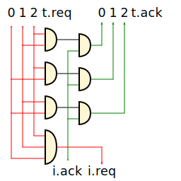
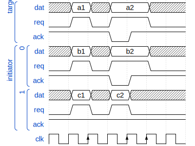
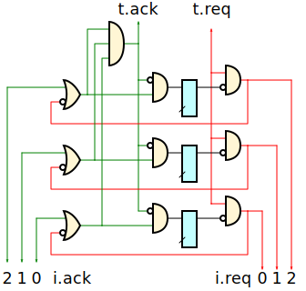
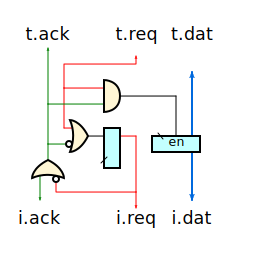

# Nodes

## join




```js
i.req = and(t[0].req, t[1].req, ..., t[n].req)

t[0].ack = and(i.ack, and(1,        t[1].req, ..., t[n].req))
t[1].ack = and(i.ack, and(t[0].req, 1,        ..., t[n].req))
...
t[n].ack = and(i.ack, and(t[0].req, t[1].req, ..., 1       ))
```


## fork





```js
t.ack = and(i[0].ack, i[1].ack, ..., i[n].ack)

i[0].ackr.next = and(i[0].ack, ~(i.ack))
i[1].ackr.next = and(i[1].ack, ~(i.ack))
...
i[n].ackr.next = and(i[n].ack, ~(i.ack))

i[0].req = and(t.req, ~(i[0].ackr))
i[1].req = and(t.req, ~(i[1].ackr))
...
i[n].req = and(t.req, ~(i[n].ackr))
```

## EB1



```js
t.ack = ~t.req | i.ack;

i.dat.next = t.dat;
i.dat.enable = t.req & i.ack;

i.req.next = (~i.ack | t.req);
```

## EB2


```js
fsm(state.next, {
    S0: { S1: t.req },
    S1: {
        S0: (~t.req & i.ack),
        S2: (t.req & ~i.ack),
        S3: (t.req & i.ack)
    },
    S2: { S3: i.ack },
    S3: {
        S0: (~t.req & i.ack),
        S4: (t.req & ~i.ack),
        S1: (t.req & i.ack)
    },
    S4: { S1: i.ack }
})

sel = ((state == S3) | (state == S4))

dat0.enable = ((state == S0) | (state == S3)) & t.req
dat1.enable =  (state == S1)                & t.req

t.ack = ~((state == S2) | (state == S4));

i.req = ~(state == S0);

i.dat = sel ? dat1 : dat0;

dat0.next = t.dat;
dat1.next = t.dat;

```
