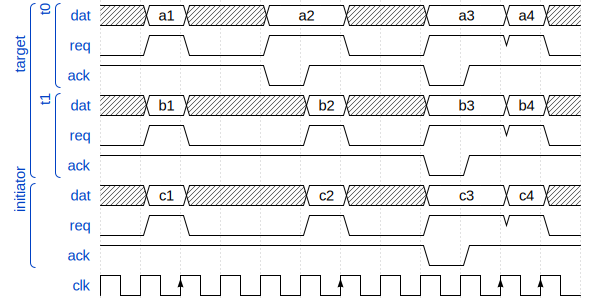

# Nodes

## reduce



```js
i.req = and(t[0].req, t[1].req, ..., t[n].req)
t[0].ack = and(i.ack, and(1,        t[1].req, ..., t[n].req))
t[1].ack = and(i.ack, and(t[0].req, 1,        ..., t[n].req))
t[n].ack = and(i.ack, and(t[0].req, t[1].req, ..., 1       ))
```


## fork


```js
i[0].req = and(t.req, i[1].done, i[n].done)
i[1].req = and(t.req, i[1].done, i[n].done)
i[n].req = and(t.req, i[1].done, i[n].done)
```
