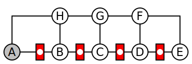
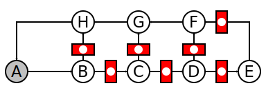
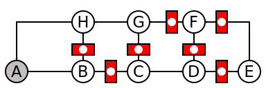
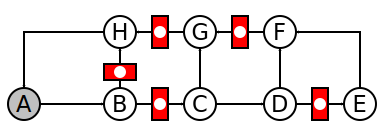

# Retiming

### Construct circuit

```js
var A = node();
var B = node();
var C = node();
var D = node();
var E = node();
var F = node();
var G = node();
var H = node();

stage(A.o, B.i)
stage(B.o[0], C.i)
stage(C.o[0], D.i)
stage(D.o[0], E.i)

link(E.o, F.i[0])
link(D.o[1], F.i[1])
link(F.o, G.i[0])
link(C.o[1], G.i[1])
link(G.o, H.i[0])
link(B.o[1], H.i[1])
link(H.o, A.i)
```
<!--  -->


### Step 1

```js
B.retime()
C.retime()
D.retime()
E.retime()
```
<!--  -->


### Step 2

```js
D.retime()
E.retime()
F.retime()
```
<!--  -->


### Step 3

```js
F.retime()
G.retime()
```
<!--  -->


### Steps 1-2-3 combined

```js
B.retime()
C.retime()
D.retime(2)
E.retime(2)
F.retime(2)
G.retime()
```
